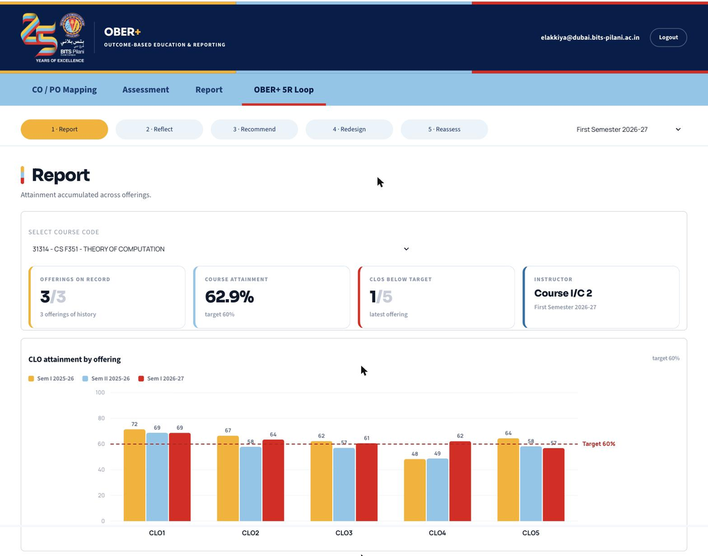
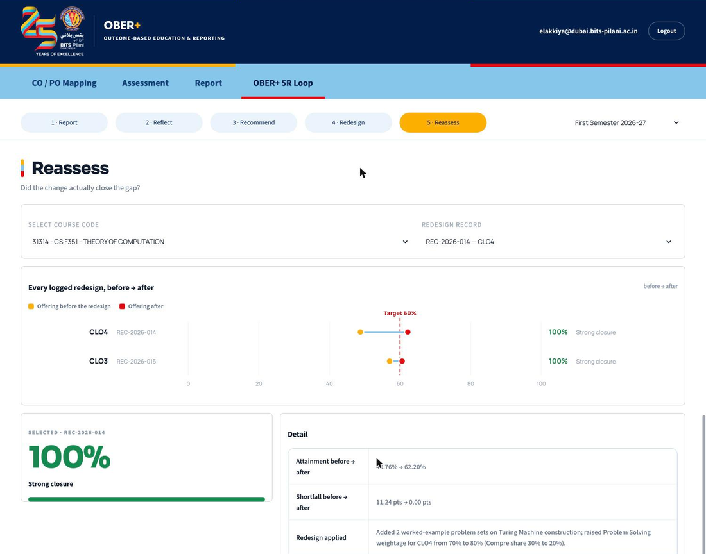

<div align="center">


<br>

[](requirements.txt)
[](https://streamlit.io)
[](https://oberplus.streamlit.app/)
[](https://www.bits-pilani.ac.in/dubai/)

**[Open the live app →](https://oberplus.streamlit.app/)**

</div>

---

OBER+ is BPDC OBER with a continuous-improvement layer added on top. The
CO/PO Mapping, Assessment and Report sections work exactly as they do in the
deployed tool at `ober.bits-dubai.ac.ae`. The OBER+ section adds five stages —
**Report, Reflect, Recommend, Redesign, Reassess** — that run on the same data
without changing how attainment is computed.

## Contents

- [Screenshots](#screenshots)
- [Running it](#running-it)
- [Sections](#sections)
- [Interface](#interface)
- [How attainment is computed](#how-attainment-is-computed)
- [Data](#data)
- [Files](#files)
- [Citation](#citation)

## Screenshots

<table>
<tr>
<td width="50%"></td>
<td width="50%"></td>
</tr>
<tr>
<td align="center"><sub><b>R1 · Report</b> — attainment accumulated across offerings</sub></td>
<td align="center"><sub><b>R5 · Reassess</b> — did the redesign actually close the gap</sub></td>
</tr>
</table>

## Running it

```bash
pip install -r requirements.txt
streamlit run app.py
```

## Sections

### CO / PO Mapping

| Screen | What it does |
|---|---|
| Handout Upload | Course handout per course code, with download-back |
| CLO Entry | Add / edit / delete CLOs |
| Evaluation Components | Marks per component, plus the weightage and mark-distribution matrices |
| CLO-PLO Mapping | CLO × PLO grid, 1 per mapped cell |

### Assessment

| Screen | What it does |
|---|---|
| Marks Entry | Download the template, fill it in, upload it back — a blank cell reads as ABSENT |

### Report

| Screen | What it does |
|---|---|
| Marks Report | Every student's marks, by component and CLO |
| CLO Report | Diverging bar of each CLO vs. target, then per-component breakdown and course attainment |
| PLO Report | CLO → PLO grid against the target rule; unmapped PLOs are left out, not drawn as zero |

### OBER+ · 5R loop

| Stage | What it does |
|---|---|
| **R1 Report** | Attainment accumulated across offerings — gated on *offering count*, not calendar time |
| **R2 Reflect** | Flags CLOs below target in ≥2 of the last 3 offerings, banded by severity |
| **R3 Recommend** | A cited menu of practices against R2's evidence — nothing auto-picked |
| **R4 Redesign** | The change log — *formal* (from a recommendation) or *detected* (caught automatically) |
| **R5 Reassess** | Before → after gap closure for every logged redesign |

<details>
<summary>Scoring & banding rules</summary>

- **R1** — offering-count gating, not calendar time: an elective run twice a year clears the 3-offering window in ~1.5 years instead of 3.
- **R2** — severity = average shortfall across only the offerings that missed; banded High / Medium / Low / Very Low on CAA's own KPI 2.1 cutoffs (90 / 60 / 30 / 0, OBEF University Guidebook v11.5). Runs a CLO wording / RBT drift check alongside — never instead of — the flag.
- **R4** — *Formal* records implement a recorded R3 recommendation; *detected* records are changes R2's drift check caught with no recommendation behind them.
- **R5** — Gap Closure = (shortfall before − shortfall after) ÷ shortfall before, banded on the same cutoffs as R2.

</details>

## Interface

Navy is chrome only — the masthead and nav bar. Everything below it runs on
the campus tagline palette: **innovate amber**, **achieve sky**, **lead red**,
cycled per section so a page title tells you where you are before you read
the heading. Table headers are sky, the one primary action per screen is
amber, row actions stay quiet. Band colours (High/Medium/Low/Very Low) are
reserved separately — they mean severity, never decoration.

| Token | Hex | Role |
|---|---|---|
| Navy | `#011E4B` | Structure — masthead, nav, headings |
| Amber | `#FAB001` | Innovate — primary action, one colour per section in turn |
| Sky | `#87C6E9` | Achieve — table headers, the next colour in turn |
| Red | `#E40613` | Lead — the third colour in turn, never decoration alone |

## How attainment is computed

Unchanged from OBER:

```math
\text{Component attainment}(c,k) = \frac{\text{marks scored by all students for } c \text{ in } k}{\text{mark allocation for } c \text{ in } k \times \text{number of students}}
```

```math
\text{CLO attainment}(c) = \sum_{k} \text{Component attainment}(c,k) \times \frac{\text{weightage}(c,k)}{100}
```

```math
\text{Course attainment} = \sum_{c} \text{CLO attainment}(c) \times \text{CLO's share of total marks}
```

```math
\text{PLO attainment} = \text{average of the CLO attainments mapped to that PLO}
```

No stage re-derives or reweights these — R2 and R5 always read OBER's own
already-computed number for that specific offering, since each offering can
carry its own component weightages.

## Data

Ships loaded with CS F351 Theory of Computation, set up exactly as in the OBER
user guide walkthrough (same six components, same 200-mark distribution, same
CLO-PLO mapping), and CS F459 Computer Vision. Student rosters and marks are
generated so every screen and both reports have something to work on from the
first run; replace them by uploading real marks files through Marks Entry, or
point `store.py` at OBER's own database.

Edits made in the tool persist for the session.

## Files

<details>
<summary>Show the file layout</summary>

| File | |
|---|---|
| `app.py` | shell — navigation, top bar, page routing |
| `store.py` | entities, seed course setup, roster and marks |
| `compute.py` | OBER's attainment computation |
| `engine.py` | 5R helpers — banding, persistence flag, RBT classification, gap closure |
| `pages_ober.py` | CO/PO Mapping, Assessment, Report screens |
| `pages_plus.py` | R1–R5 screens |
| `style.py` | interface styling and shared components |

</details>

## Citation

Preprint: [arXiv submission 8032374](https://services.arxiv.org/html/submission/8032374/view) — pending announcement, same title and source as the submitted paper.

```bibtex
@article{OBER+2026,
  title={OBER+: Continuity-Aware Reporting and Traceable Continuous Improvement in Outcome-Based Education},
  author={Elakkiya R},
  year={September 2026}
}
```

<div align="center">
<sub>OBER+ · LEAD Academics Capstone · BITS Pilani, Dubai Campus</sub>
</div>
